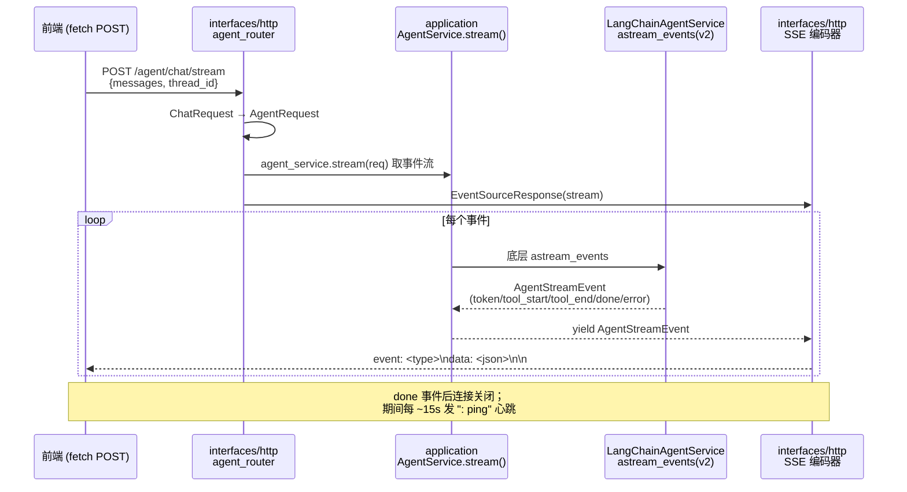

# Agent SSE 流式输出设计

| 项 | 内容 |
|---|---|
| 日期 | 2026-07-19 |
| 状态 | 已评审 · 待实现 |
| 范围 | 端到端流式链路，核心为新增 SSE HTTP 端点 |
| 相关分支 | `feature/ddd-ai-finance` |

---

## 1. 背景与现状

账票服务的 AI Agent 需要把回答"边生成边推送"给客户端：长回答逐字上屏、多步工具调用（ReAct）过程可见，显著改善交互体验。经调研采用 **SSE（Server-Sent Events）** 作为传输。

盘点当前代码库，底层流式链路**大部分已就绪**，缺口集中在对外的 HTTP 暴露层。

### 已就绪

| 组件 | 位置 | 说明 |
|---|---|---|
| `AgentService.stream()` 端口 | [`application/ports/agent_service.py`](../../../src/application/ports/agent_service.py) | 返回 `AsyncIterator[AgentStreamEvent]` |
| `AgentStreamEvent` DTO | [`application/dto/agent_dto.py`](../../../src/application/dto/agent_dto.py) | 五类事件：`token / tool_start / tool_end / done / error` |
| `LangChainAgentService.stream()` | [`interfaces/ai/react_agent.py`](../../../src/interfaces/ai/react_agent.py) | 基于 LangChain `astream_events(v2)`，`_map_event` 把底层事件映射为 `AgentStreamEvent`，异常时 yield `error` 事件 |
| FastAPI 应用 | [`bootstrap/main.py`](../../../src/bootstrap/main.py) | app / lifespan / DI 已具备（若干 GET 路由已上线） |

### 缺口

1. 没有把事件流对外暴露的 HTTP 端点。
2. 没有 `AsyncIterator[AgentStreamEvent] → text/event-stream` 的 SSE 编码器。
3. 没有 interfaces 层的请求/响应 schema。
4. `agent_service` 每请求重建，导致 `thread_id` 多轮记忆失效（见 §8）。

---

## 2. 目标与非目标

### 目标

- 新增 **`POST /agent/chat/stream`**，以 `text/event-stream` 逐事件推送 `AgentStreamEvent`。
- 顺带新增非流式 **`POST /agent/chat`**（复用已就绪的 `run()`），使流式/非流式对称。
- **`agent_service` 单例化**：在 `lifespan` 预热一次，使 `thread_id` 多轮记忆跨请求生效。
- 定义一份**稳定的 SSE 线上协议**，供前端与后端共同遵循。

### 非目标

- 不重构底层 `astream_events` 映射与事件模型（复用现状）。
- 不修正 `LangChainAgentService` 的分层位置（记为遗留项，见 §12）。
- 不做断点续传 / `Last-Event-ID` 恢复 —— 生成式输出无法"续传半句"，重连语义应为"重新发起对话"。
- 不引入 WebSocket。

---

## 3. 关键设计决策

| 决策 | 选择 | 理由 | 被否方案 |
|---|---|---|---|
| 传输方式 | **POST + SSE** | 请求体承载多轮消息历史；不把数据放 URL（隐私/安全）；与 OpenAI/Anthropic 流式 API 一致 | GET + 原生 `EventSource`（消息历史塞 query 不现实）；WebSocket（单向流过度设计） |
| SSE 实现 | **sse-starlette 的 `EventSourceResponse`** | 自动心跳保活、客户端断连检测、`event/data/id/retry` 帧格式与优雅关闭 | 裸 `StreamingResponse` 手写（心跳/断连/多行 data 边界易错） |
| `data` 编码 | **整个事件序列化为 JSON** | 换行天然转义，规避 SSE "多行 data" 陷阱；结构稳定、便于前端解析 | 纯文本 `data`（无法携带 `tool_name`/类型等结构） |
| Agent 生命周期 | **应用级单例（lifespan 预热）** | 让 `MemorySaver` 常驻，`thread_id` 记忆跨请求生效 | 每请求 `build_container()`（每次新建 `MemorySaver`，记忆丢失） |

> **澄清一个常见误区**：SSE 只是**响应体的编码格式**（`Content-Type: text/event-stream`），与请求用 GET 还是 POST 无关。只有浏览器原生的 `EventSource` 对象限定了必须 GET；用 `fetch` 或 `@microsoft/fetch-event-source` 可以对 POST 响应正常解析 SSE。

---

## 4. 架构与数据流

新增代码只有**首尾两段**（router + SSE 编码器），中间链路全部复用。



### 分层职责

| 层 | 职责 | 本次是否新增 |
|---|---|---|
| interfaces | HTTP 端点、请求/响应 schema、SSE 编码（入站适配器，只翻译） | ✅ 新增 |
| application | `AgentService` 端口、`AgentRequest/Response/StreamEvent` DTO | 复用 |
| infrastructure（职责） | LangChain agent 装配与事件映射（现状置于 `interfaces/ai/`，见 §12） | 复用 |
| bootstrap | 组合根、`lifespan` 预热单例、DI | 改造（单例化） |

---

## 5. SSE 线上协议规范

### 5.1 帧结构

每个 `AgentStreamEvent` 编码为一帧：`event:` 取事件类型，`data:` 取该事件的 JSON。帧之间以空行分隔。

```
event: token
data: {"event_type":"token","content":"发票","tool_name":null,"timestamp":"2026-07-19T08:00:01Z"}

event: tool_start
data: {"event_type":"tool_start","content":"{\"invoice_id\":\"...\"}","tool_name":"lookup_invoice","timestamp":"..."}

event: tool_end
data: {"event_type":"tool_end","content":"{...}","tool_name":"lookup_invoice","timestamp":"..."}

event: done
data: {"event_type":"done","content":"","tool_name":null,"timestamp":"..."}
```

### 5.2 事件类型

| `event` | 语义 | `content` | `tool_name` |
|---|---|---|---|
| `token` | LLM 输出的增量文本片段 | 文本增量 | `null` |
| `tool_start` | 工具开始执行 | 工具输入（字符串化） | 工具名 |
| `tool_end` | 工具执行完成 | 工具输出（字符串化） | 工具名 |
| `done` | 对话结束（顶层链结束） | 空串 | `null` |
| `error` | 流内发生异常 | 错误信息 | `null` |

### 5.3 `data` JSON schema

即 `AgentStreamEvent.model_dump_json()`：

```json
{
  "event_type": "token | tool_start | tool_end | done | error",
  "content": "string",
  "tool_name": "string | null",
  "timestamp": "ISO-8601 UTC"
}
```

### 5.4 心跳 / 结束 / 错误 / 断连语义

- **心跳**：`EventSourceResponse(ping=15)` 每 ~15s 发注释行 `: ping`，防止中间代理掐断空闲连接。前端应忽略注释行。
- **结束**：`done` 帧后生成器自然结束，服务端关闭连接。前端收到 `done` 即停止读取。
- **错误**：流一旦开始（HTTP 200 已发出），**中途错误无法再改状态码**，只能作为 `error` 事件帧下发，随后收尾。这是 SSE 的固有约束，前端需据 `error` 事件而非 HTTP 状态判断流内失败。
- **断连**：客户端断开时，sse-starlette 检测到 `request.is_disconnected()` 并关闭生成器（`GeneratorExit`），连带取消上游 `astream`，避免 LLM 继续空转烧 token。

### 5.5 HTTP 响应头

```
Content-Type: text/event-stream
Cache-Control: no-cache
Connection: keep-alive
X-Accel-Buffering: no   # 若经 Nginx，关闭缓冲以保证逐帧下发
```

---

## 6. 端点契约

### 6.1 `POST /agent/chat/stream`（流式）

**请求体**
```json
{
  "messages": [{"role": "user", "content": "帮我查发票 12345 的税额"}],
  "thread_id": "可选，传入可恢复多轮上下文"
}
```

**响应**：`200 OK`，`Content-Type: text/event-stream`，SSE 事件流（见 §5）。

**示例**
```bash
curl -N -X POST http://localhost:8000/agent/chat/stream \
  -H 'Content-Type: application/json' \
  -d '{"messages":[{"role":"user","content":"你好"}]}'
```

### 6.2 `POST /agent/chat`（非流式）

**请求体**：同上。

**响应**：`200 OK`，`application/json`
```json
{"reply": "……", "thread_id": "……", "tool_calls_count": 1}
```

---

## 7. 组件设计（按层）

> 以下代码为**结构示意**，实现时以实际类型与项目风格为准；全项目统一 Pydantic v2，禁止 dataclass。

### 7.1 `interfaces/http/schemas.py`

```python
from typing import Literal
from pydantic import BaseModel, Field
from application.dto.agent_dto import AgentRequest

class ChatMessage(BaseModel):
    role: Literal["user", "assistant", "system"] = "user"
    content: str

class ChatRequest(BaseModel):
    messages: list[ChatMessage] = Field(default_factory=list)
    thread_id: str | None = None

    def to_agent_request(self) -> AgentRequest:
        return AgentRequest(
            messages=[m.model_dump() for m in self.messages],
            thread_id=self.thread_id,
        )

class ChatResponse(BaseModel):
    reply: str
    thread_id: str | None = None
    tool_calls_count: int = 0
```

### 7.2 `interfaces/http/sse.py` —— SSE 编码器

```python
from collections.abc import AsyncIterator
from application.dto.agent_dto import AgentStreamEvent

async def to_sse_events(
    events: AsyncIterator[AgentStreamEvent],
) -> AsyncIterator[dict]:
    """把领域事件流编码为 sse-starlette 可消费的帧字典。"""
    async for ev in events:
        yield {"event": ev.event_type, "data": ev.model_dump_json()}
```

### 7.3 `interfaces/http/agent_router.py` —— 路由

```python
from fastapi import APIRouter, Depends
from sse_starlette.sse import EventSourceResponse

from application.ports.agent_service import AgentService
from bootstrap.dependencies import get_agent_service
from interfaces.http.schemas import ChatRequest, ChatResponse
from interfaces.http.sse import to_sse_events

router = APIRouter(prefix="/agent", tags=["agent"])

@router.post("/chat/stream")
async def chat_stream(
    req: ChatRequest,
    agent: AgentService = Depends(get_agent_service),
) -> EventSourceResponse:
    stream = agent.stream(req.to_agent_request())
    return EventSourceResponse(to_sse_events(stream), ping=15)

@router.post("/chat", response_model=ChatResponse)
async def chat(
    req: ChatRequest,
    agent: AgentService = Depends(get_agent_service),
) -> ChatResponse:
    resp = await agent.run(req.to_agent_request())
    return ChatResponse(**resp.model_dump())
```

### 7.4 bootstrap 改造

**`main.py`**：注册路由。
```python
from interfaces.http.agent_router import router as agent_router
app.include_router(agent_router)
```

**`lifespan`**：预热 `agent_service` 单例（在 `llm_repo.load()` 之后）。
```python
container = await build_container(config=llm_repo.get())
app.state.agent_service = container.agent_service
logger.info("AgentService 已预热（单例）")
```

**`dependencies.py`**：DI 直接取单例，不再每请求 `build_container`。
```python
from application.ports.agent_service import AgentService

def get_agent_service(request: Request) -> AgentService:
    return request.app.state.agent_service
```

> `get_agent_service` 沿用现有 `bootstrap/dependencies.py`（与其它 `get_*` DI 函数一致）。这会让 `interfaces/http` 反向 import `bootstrap`；如需严格贴合 CLAUDE.md「DI 属 interfaces」，可后续把 DI 函数迁入 interfaces，本次不做。

---

## 8. Agent 单例化（DI 生命周期）

**现状问题**：[`get_container`](../../../src/bootstrap/dependencies.py) 每个请求都 `await build_container(...)`，即每请求新建一个 `MemorySaver()`。`thread_id` 依赖 checkpointer 常驻才能跨请求恢复上下文，因此当前多轮记忆**实际失效**。

**改造**：`agent_service`（含其 `MemorySaver`）在 `lifespan` 预热一次、存 `app.state`，请求间共享。

**并发与线程安全**：LangGraph 编译后的 agent 支持并发 `ainvoke`/`astream`，会话状态按 `thread_id` 在 checkpointer 中隔离，单例共享安全。`MemorySaver` 为进程内存实现，多副本部署时记忆不共享——未来如需跨副本，替换为持久化 checkpointer（如 Redis/Postgres）即可，不影响本设计的接口。

---

## 9. 错误处理与边界

| 场景 | 处理 |
|---|---|
| 请求体校验失败 | 进入流之前由 FastAPI/Pydantic 拦截，返回 `422` |
| `agent_service` 未就绪 | `get_agent_service` 发现 `app.state` 缺失 → `503` |
| 流内 LLM/工具异常 | 已由 `stream()` yield `error` 事件 → 编码为 `error` 帧后收尾（HTTP 状态已是 200，见 §5.4） |
| 客户端断连 | sse-starlette 关闭生成器 → 取消上游 `astream` |
| 空 `messages` | 由 schema / 应用层校验；建议返回 `422` 而非空流 |

---

## 10. 依赖变更

- `uv add sse-starlette`
- 需在 uv 解析时确认与 `fastapi==0.139` / 其 starlette 版本兼容；如有冲突，锁定 sse-starlette 到兼容区间。

---

## 11. 测试策略

**单元测试**
- `_map_event`：五类 LangChain 事件 → `AgentStreamEvent` 的映射正确、无关事件返回 `None`。
- `to_sse_events`：给定 `AgentStreamEvent` 序列，产出 `{"event","data"}` 帧、`data` 为合法 JSON。
- `ChatRequest.to_agent_request`：messages 转换正确。

**集成测试**（`httpx.ASGITransport`，注入 stub `AgentService` 避免真实 LLM）
- `POST /agent/chat/stream`：`Content-Type: text/event-stream`；帧序列含预期 `event:` 类型并以 `done` 收尾。
- `POST /agent/chat`：返回 `ChatResponse` 结构正确。
- 流内 `error` 事件：stub 抛异常时收到 `error` 帧。

---

## 12. 已知遗留 / 后续项

- **`LangChainAgentService` 分层位置**：依赖 LangChain 又实现应用层端口，按 CLAUDE.md 铁律本应在 `infrastructure`，现在 `interfaces/ai/`。本次不动，另行修正。
- **CLAUDE.md 更新**："Web：FastAPI（尚未接入）"已过时，FastAPI 实已接入。
- **`AgentStreamEvent.timestamp`**：默认工厂用 `datetime.utcnow`（Python 3.12+ 已弃用），而 `_map_event` 用 `datetime.now(timezone.utc)`，两处不一致，建议统一为后者。
- **CORS**：前端跨域消费时需加 `CORSMiddleware`（部署项，非本次核心）。
- **鉴权 / 限流**：流式端点长连接的鉴权与并发上限，未来补充。

---

## 13. 附录：前端消费示例

原生 `EventSource` 只支持 GET，POST + SSE 用 `fetch` 手工解析，或用 `@microsoft/fetch-event-source`：

```js
import { fetchEventSource } from '@microsoft/fetch-event-source';

await fetchEventSource('/agent/chat/stream', {
  method: 'POST',
  headers: { 'Content-Type': 'application/json' },
  body: JSON.stringify({ messages: [{ role: 'user', content: '你好' }] }),
  onmessage(ev) {
    const data = JSON.parse(ev.data);
    switch (ev.event) {
      case 'token':      appendText(data.content); break;
      case 'tool_start': showToolBadge(data.tool_name); break;
      case 'tool_end':   hideToolBadge(data.tool_name); break;
      case 'done':       finish(); break;
      case 'error':      showError(data.content); break;
    }
  },
});
```
