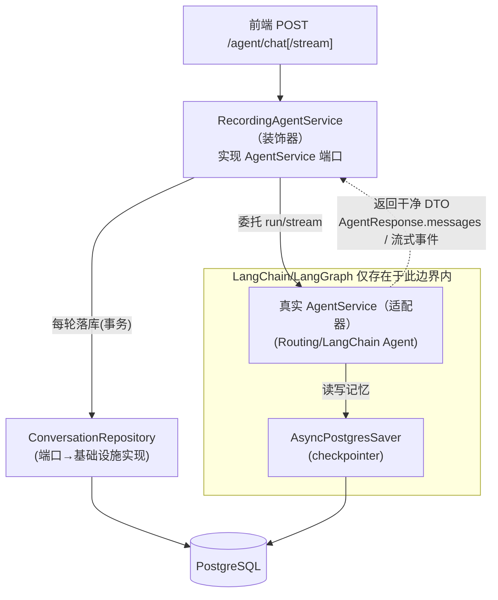
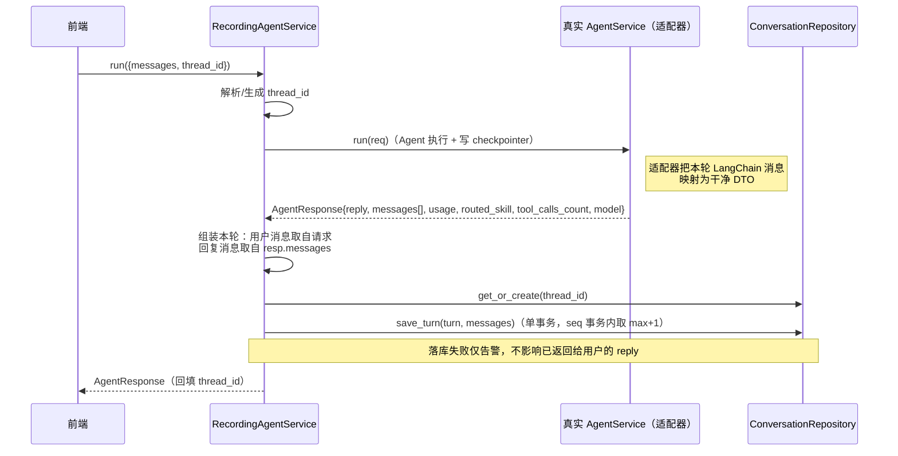
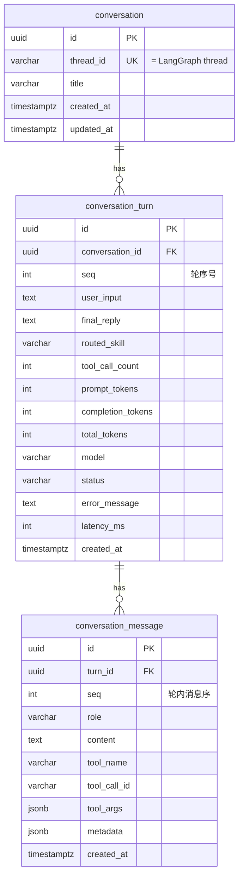

# LangChain 对话持久化设计（PostgreSQL）

| 项 | 内容 |
|---|---|
| 日期 | 2026-07-19 |
| 状态 | 已评审 · 待实现 |
| 范围 | Agent 多轮对话的持久化：业务对话记录表（自建）+ LangGraph 持久化记忆（checkpointer） |
| 相关分支 | `feature/ddd-ai-finance` |
| 相关设计 | [Agent SSE 流式输出设计](2026-07-19-agent-sse-streaming-design.md) · [Agent 动态路由与意图识别设计](2026-07-19-intent-routing-design.md) |

---

## 1. 背景与现状

账票服务的 AI Agent 已具备 `run`（非流式）与 `stream`（SSE 流式）两种出口，靠 LangGraph 的 `thread_id` 维持多轮对话记忆。但**记忆与对话内容都未落地**：

| 现状 | 位置 | 问题 |
|---|---|---|
| 记忆用进程内 `MemorySaver` | [`infrastructure/ai/agent_factory.py:41`](../../../src/infrastructure/ai/agent_factory.py) | 重启即丢；多副本部署记忆不共享（[SSE 设计 §8](2026-07-19-agent-sse-streaming-design.md) 已记为缺口） |
| 装配 Agent 未传 checkpointer | [`bootstrap/container.py:98`](../../../src/bootstrap/container.py) | 每次 `build_container` 新建一个 `MemorySaver`，多轮记忆实际失效 |
| 无任何业务对话记录 | — | 无法回看历史、审计、统计 token / 工具调用 / 路由命中 |
| DB engine 装配在途重构 | [`infrastructure/config/database_config.py`](../../../src/infrastructure/config/database_config.py) | 旧 `database.py` 已删，`create_db_engine` 缺失，`container.py:22,80` 仍 import 已删模块——**当前是断的**；新 `database_config.py` 只有 `PostgresConfig`，尚无 engine/session 工厂 |

**需求**：把「LangChain 每轮对话」持久化到 PostgreSQL。经确认包含两件事：

1. **业务对话记录**（自建表）：每轮对话落库，供历史回看、审计、统计分析。
2. **LangGraph 持久化记忆**（checkpointer）：把 `MemorySaver` 换成 Postgres 版，让 Agent 记忆重启不丢、多副本共享。

---

## 2. 目标与非目标

### 目标

- 设计并落地 **3 张业务对话表**（混合粒度）：`conversation` → `conversation_turn` → `conversation_message`，用 SQLAlchemy 2.0（asyncpg），**Alembic** 管迁移。
- 用官方 **`AsyncPostgresSaver`** 替换 `MemorySaver`，Agent 记忆持久化。
- 新增 **`RecordingAgentService` 装饰器**（实现现有 `AgentService` 端口），在每轮完成后落库，**interfaces / SSE 层零改动**。
- **补齐 DB engine/session 工厂**，收口在途的 `database` → `database_config` 重构。

### 非目标

- **不设计、不迁移 checkpointer 表**：`checkpoints / checkpoint_blobs / checkpoint_writes / checkpoint_migrations` 由 `AsyncPostgresSaver.setup()` 自建自迁，不进我们的 Alembic。
- **不引入用户体系**：本期用 `thread_id` 组织对话，`user_id / tenant_id` 记为后续项。
- 不改 SSE 的 5 类基础事件与 intent-routing 的 `routing` 事件模型（复用现状）。
- 不做对话全文检索 / RAG / 向量化（后续另立）。
- MVP 不做流式端「服务端生成 thread_id 的回显机制」（见 §7.4，本期客户端供 thread_id）。

---

## 3. 关键设计决策

| 决策 | 选择 | 理由 | 被否方案 |
|---|---|---|---|
| 存储粒度 | **混合：轮表 + 消息子表** | `turn` 存每轮聚合指标（路由技能 / 工具次数 / token / 耗时）便于统计审计；`message` 存逐条消息可完整重建对话（含工具消息） | 纯 messages 表（每轮聚合需现算，统计弱）；纯 turns 表（工具明细塞 JSON，丢结构化查询） |
| Checkpointer 驱动 | **官方 `langgraph-checkpoint-postgres`（psycopg3）** | 官方维护，序列化 / 迁移 / pending-writes 都由其负责，`setup()` 自动建表 | 自撸 asyncpg 版 `BaseCheckpointSaver`（重、易错、要自维护迁移）；继续用 `MemorySaver`（不满足持久化诉求） |
| 双 PG 驱动 | **接受**：业务表走 asyncpg，checkpointer 走 psycopg | 两个连接池代价可控，换取官方 saver 的稳定性 | 统一驱动（需放弃官方 saver 或放弃 asyncpg，得不偿失） |
| 写入路径 | **`RecordingAgentService` 装饰器** | 实现现有 `AgentService` 端口，包在真实 agent 外层，与 intent-routing 的 `RoutingAgentService` 同构，interfaces/SSE/DI 零改动 | 写在 `LangChainAgentService` 内部（耦合、破坏分层）；从 checkpoint 反查生成（脆弱） |
| 消息明细来源 | **仅经 `AgentService` 端口的干净 DTO**：用户消息取自请求，本轮回复消息取自 `AgentResponse.messages`（流式则累积事件） | **与 LangGraph 消息结构解耦**——LangChain→DTO 的翻译只留在 Agent 适配器（端口边界内），recorder / repository / DTO 全不依赖 LangGraph | 读 checkpointer 状态增量（recorder 耦合 LangGraph 内部结构，**已否**） |
| 单轮 token | **落在 `conversation_turn`**（prompt/completion/total） | 审计与成本统计的核心指标；由适配器汇总本轮各 AIMessage 的 `usage_metadata` 经 DTO 传出，不耦合 LangGraph | 只算全会话总量（丢每轮粒度）；不落（无法成本核算） |
| 主键 | **UUID（`gen_random_uuid()`）** | 分布式友好、无需回读自增 | bigint identity（跨库/前端暴露不便） |
| 归属组织 | **`thread_id`（无用户体系）** | 与需求一致；`conversation.thread_id` 同时是 LangGraph thread，天然关联两套数据 | 现在就上 user/tenant（YAGNI） |
| 记录失败策略 | **best-effort，不阻断对话** | 落库是「尽力增强」的审计旁路，失败只告警，绝不让用户这轮对话失败 | 强一致双写（把审计故障放大成对话故障） |

---

## 4. 架构与数据流

### 4.1 分层与组件

对外仍只有一个 `AgentService` 入口；持久化复杂度内敛于装饰器与基础设施。



> **解耦边界**：所有 LangChain / LangGraph 结构只出现在 `AgentService` 适配器与 checkpointer 内（图中 `BOUND`）。`RecordingAgentService`、`ConversationRepository` 及所有记录 DTO 只见 `AgentResponse` / `AgentStreamEvent` 这类干净 DTO，**不读 checkpointer、不识 LangChain 消息类型**。

### 4.2 两套数据、一个数据库

| 数据 | 表 | 归谁管 | 驱动 |
|---|---|---|---|
| 业务对话记录 | `conversation` / `conversation_turn` / `conversation_message` | 我们（Alembic 迁移） | asyncpg（SQLAlchemy 2.0） |
| Agent 持久化记忆 | `checkpoints` / `checkpoint_blobs` / `checkpoint_writes` / `checkpoint_migrations` | LangGraph（`saver.setup()`） | psycopg3 |

两套表同库，靠 **`thread_id` 值关联**（无跨库外键）。

### 4.3 写入时序（以非流式 `run` 为例）



流式 `stream` 同构：先委托 `inner.stream` 把事件透传给前端（体验不受落库影响），事件耗尽（收到 `done`）后，从**累积的事件**（`token` → 回复文本、`tool_start/tool_end` → 工具消息、`routing` → routed_skill、`done` → usage）组装本轮再落库。两条路径都只消费干净 DTO，不读 checkpointer。

---

## 5. 表结构（核心交付）

### 5.1 ER 图



### 5.2 `conversation`（会话线程，1 条 = 1 个 thread_id）

| 列 | 类型 | 约束 | 说明 |
|---|---|---|---|
| `id` | UUID | PK, default `gen_random_uuid()` | 代理主键 |
| `thread_id` | VARCHAR(255) | **UNIQUE NOT NULL** | 交给 LangGraph 的 thread_id，与 checkpointer 同值关联 |
| `title` | VARCHAR(255) | NULL | 展示用，可由首条用户消息派生 |
| `created_at` | timestamptz | NOT NULL, default `now()` | |
| `updated_at` | timestamptz | NOT NULL, default `now()` | 有新轮时 bump |

索引：`UNIQUE(thread_id)`。

### 5.3 `conversation_turn`（每轮，聚合指标）

| 列 | 类型 | 约束 | 说明 |
|---|---|---|---|
| `id` | UUID | PK | |
| `conversation_id` | UUID | FK→`conversation(id)` **ON DELETE CASCADE**, NOT NULL | |
| `seq` | INT | NOT NULL | 轮序号（1,2,3…） |
| `user_input` | TEXT | NOT NULL | 本轮用户输入（冗余，列表/统计友好） |
| `final_reply` | TEXT | NULL | Agent 最终回复；出错未回复则空 |
| `routed_skill` | VARCHAR(128) | NULL | 意图路由命中技能（对接 intent-routing 的 `routed_skill`） |
| `tool_call_count` | INT | NOT NULL, default `0` | 对应 `AgentResponse.tool_calls_count` |
| `prompt_tokens` | INT | NULL | **单轮 token 消耗**（输入）；适配器汇总本轮 AIMessage `usage_metadata` 经 DTO 传出 |
| `completion_tokens` | INT | NULL | 单轮 token 消耗（输出） |
| `total_tokens` | INT | NULL | 单轮合计（= 输入 + 输出） |
| `model` | VARCHAR(128) | NULL | 实际模型 id（如 `deepseek-chat`） |
| `status` | VARCHAR(32) | NOT NULL, default `'completed'` | `completed` / `error` |
| `error_message` | TEXT | NULL | `status='error'` 时 |
| `latency_ms` | INT | NULL | 本轮耗时（毫秒） |
| `created_at` | timestamptz | NOT NULL, default `now()` | |

索引：`UNIQUE(conversation_id, seq)`；`INDEX(conversation_id, created_at)`；`INDEX(routed_skill)`、`INDEX(created_at)`（统计用）。

### 5.4 `conversation_message`（轮内逐条消息，完整重建对话）

| 列 | 类型 | 约束 | 说明 |
|---|---|---|---|
| `id` | UUID | PK | |
| `turn_id` | UUID | FK→`conversation_turn(id)` **ON DELETE CASCADE**, NOT NULL | |
| `seq` | INT | NOT NULL | 轮内消息序 |
| `role` | VARCHAR(32) | NOT NULL | `user` / `assistant` / `tool` |
| `content` | TEXT | NULL | 文本内容；纯工具调用的 assistant 可空 |
| `tool_name` | VARCHAR(255) | NULL | 工具名（assistant 发起调用 / tool 结果） |
| `tool_call_id` | VARCHAR(255) | NULL | 关联 assistant 的 tool_call 与 tool 结果 |
| `tool_args` | JSONB | NULL | 工具入参 |
| `metadata` | JSONB | NOT NULL, default `'{}'` | 扩展位（finish_reason、per-msg token 等） |
| `created_at` | timestamptz | NOT NULL, default `now()` | |

索引：`UNIQUE(turn_id, seq)`。

### 5.5 约定

- **`system` 消息不落库**：系统提示词由技能配置固定派生，每轮冗余存储无价值。
- **工具输出即一条 `role='tool'` 消息**：`content` 存结果文本，`tool_name` / `tool_call_id` 关联发起方。
- **整段对话重放** = `conversation_turn.seq` 升序，再 `conversation_message.seq` 升序。
- `gen_random_uuid()` 需 PostgreSQL 13+（内建，无需扩展）；低版本改挂 `pgcrypto`。

---

## 6. Checkpointer 集成（LangGraph 持久化记忆）

### 6.1 依赖与建表

- `uv add langgraph-checkpoint-postgres`（引入 `psycopg` / `psycopg-pool`）。
- 启动时执行一次 `await saver.setup()`：幂等地创建/迁移 `checkpoints`、`checkpoint_blobs`、`checkpoint_writes`、`checkpoint_migrations`。**这些表不进 Alembic**。

### 6.2 装配与生命周期

```python
# bootstrap：lifespan 内建立单例 saver，注入 agent_factory
saver = AsyncPostgresSaver(conn_pool)   # psycopg 连接池，来自 DATABASE_URL
await saver.setup()
app.state.checkpointer = saver
# create_react_agent(..., checkpointer=saver) —— 取代默认 MemorySaver
```

- `agent_factory.create_react_agent` 已支持 `checkpointer` 入参（[agent_factory.py:22](../../../src/infrastructure/ai/agent_factory.py)），把默认 `MemorySaver` 改为注入 `AsyncPostgresSaver`。
- **单例**：saver 及其连接池在 `lifespan` 建一次、存 `app.state`，与 SSE 设计的「agent 单例化」一致；`thread_id` 记忆跨请求、跨重启生效。
- psycopg 连接串由 `DATABASE_URL` 转换而来（asyncpg DSN `postgresql+asyncpg://…` → psycopg `postgresql://…`），在 `database_config` 派生一个 `psycopg_dsn` 属性统一产出。

### 6.3 与业务表的关系

`conversation.thread_id` 就是传给 `create_react_agent(config={"configurable": {"thread_id": ...}})` 的值，两套数据靠该值对应。checkpointer 是 Agent 记忆的**唯一事实源**；业务表是**审计/展示旁路**，二者写入不要求原子（见 §10）。

---

## 7. 写入路径：`RecordingAgentService`

### 7.1 端口与模型（application 层，Pydantic，**零 LangGraph 依赖**）

沿用现有 `application/ports/` 放置支持性端口（与 `agent_service` / `llm_factory` 同级），不塞进 billing `domain`。**去掉了原方案的 `ConversationSnapshotReader`**——不再有任何组件去读 checkpointer 状态。

```python
# application/ports/conversation_repository.py
class ConversationRepository(Protocol):
    async def get_or_create(self, thread_id: str) -> ConversationRecord: ...
    # save_turn 在同一事务里取 seq = max(seq)+1，避免额外往返与竞态
    async def save_turn(self, turn: TurnRecord, messages: list[TurnMessage]) -> None: ...
```

记录 DTO（`application/dto/conversation_dto.py`，全 Pydantic v2、无 LangChain 类型）：

```python
class TokenUsage(BaseModel):
    prompt_tokens: int; completion_tokens: int; total_tokens: int
    model_config = {"frozen": True}

class TurnMessage(BaseModel):           # 轮内一条消息（干净 DTO）
    role: Literal["user", "assistant", "tool"]
    content: str | None = None
    tool_name: str | None = None
    tool_call_id: str | None = None
    tool_args: dict | None = None
    metadata: dict = Field(default_factory=dict)

class ConversationRecord(BaseModel): id: UUID; thread_id: str
class TurnRecord(BaseModel):            # 聚合指标；seq 由 repo 事务内产出
    user_input: str; final_reply: str | None = None
    routed_skill: str | None = None; tool_call_count: int = 0
    usage: TokenUsage | None = None; model: str | None = None
    status: Literal["completed", "error"] = "completed"
    error_message: str | None = None; latency_ms: int | None = None
```

**对现有 Agent DTO 的增补**（`application/dto/agent_dto.py`，向后兼容、纯追加）：

| DTO | 新增字段 | 用途 |
|---|---|---|
| `AgentResponse` | `messages: list[TurnMessage] = []`、`usage: TokenUsage \| None`、`model: str \| None` | 非流式：适配器把**本轮**回复消息与 token 以干净 DTO 交出（`routed_skill` 已由 intent-routing 设计追加） |
| `AgentStreamEvent` | `usage: TokenUsage \| None = None` | 流式：`usage` 挂在 `done` 事件上下发，供装饰器累积 |

### 7.2 装饰器职责

> 以下为**结构示意**，实现时以实际类型与项目风格为准（`AgentRequest/Response` 用 `model_copy(update=...)` 派生）。装饰器**只见干净 DTO**，构造参数里没有 snapshot / checkpointer。

```python
# application/services/recording_agent_service.py（实现 AgentService 端口）
class RecordingAgentService:
    def __init__(self, inner: AgentService, repo: ConversationRepository): ...

    async def run(self, req: AgentRequest) -> AgentResponse:
        thread_id = req.thread_id or _new_thread_id()
        req = req.model_copy(update={"thread_id": thread_id})
        resp = await self._inner.run(req)
        await self._record(thread_id, req, resp)   # 失败仅告警，见 §10
        return resp.model_copy(update={"thread_id": thread_id})

    async def stream(self, req: AgentRequest):
        thread_id = req.thread_id or _new_thread_id()
        req = req.model_copy(update={"thread_id": thread_id})
        agg = _Aggregator()             # 从事件累积：文本 / 工具消息 / routed_skill / usage
        async for ev in self._inner.stream(req):
            agg.observe(ev)
            yield ev                     # 先透传，体验不受落库影响
        await self._record_from_agg(thread_id, req, agg)  # done 后落库，失败仅告警
```

### 7.3 落一轮（`_record`）

1. `conv = repo.get_or_create(thread_id)`。
2. 组装本轮 `messages`：**用户消息取自 `req.messages`**（装饰器本就持有，无需向 Agent 要）；**回复消息取自 `resp.messages`**（非流式）或事件累积（流式）。
3. 组装 `TurnRecord`：`user_input` = 本轮用户输入文本；`final_reply` / `usage` / `model` / `routed_skill` / `tool_call_count` / `latency_ms` 取自 `AgentResponse` 或聚合器。
4. `repo.save_turn(turn, messages)` —— **单事务**写 turn + messages（seq 事务内取 `max+1`），并 bump `conversation.updated_at`。

全程不出现 LangChain / LangGraph 类型，也不读 checkpointer。

### 7.4 thread_id 解析

- 请求带 `thread_id`：get-or-create 复用。
- 不带：服务端生成 UUID。**非流式**在 `AgentResponse.thread_id` 回传（字段已存在）；**流式** MVP 约定由客户端为新会话预生成 thread_id 传入（标准聊天模式），服务端回显机制记为后续项（§13）。

### 7.5 翻译边界：适配器是唯一认识 LangChain 的地方

解耦的关键落点——**所有 LangChain / LangGraph → DTO 的翻译只发生在 Agent 适配器内**（`AgentService` 端口的实现体）：

- **非流式 `run`**：适配器取**本轮新产生**的消息（用 LangGraph `stream_mode="updates"` 的节点增量，天然只含本次调用的新消息，**无需读 checkpointer、无需 diff 全量 state**），映射为 `list[TurnMessage]`；汇总各 AIMessage 的 `usage_metadata` 为 `TokenUsage`；连同 `model` 填入 `AgentResponse`。
- **流式 `stream`**：`_map_event` 在最终 `on_chat_model_end` / 链结束时提取 usage，挂到 `done` 事件；`token`/`tool_start`/`tool_end`/`routing` 事件已够装饰器重建消息与聚合。

> 已知差异：流式事件当前不含 `tool_call_id` 与逐 token usage，故**流式明细可能略粗于非流式**——可接受，记为后续项。无论哪条路径，装饰器与仓储都只消费干净 DTO。

---

## 8. 分层落点（DDD）

| 组件 | 位置 | 层 | 新增/改造 |
|---|---|---|---|
| `ConversationRepository` 端口 | `application/ports/conversation_repository.py` | application | 新增 |
| `ConversationRecord / TurnRecord / TurnMessage / TokenUsage`（Pydantic） | `application/dto/conversation_dto.py` | application | 新增 |
| `AgentResponse` / `AgentStreamEvent` 字段增补（`messages` / `usage` / `model`） | `application/dto/agent_dto.py` | application | 改造（纯追加、向后兼容） |
| `RecordingAgentService` 装饰器 | `application/services/recording_agent_service.py` | application | 新增 |
| **适配器**：本轮消息 + usage → 干净 DTO 的映射（唯一认识 LangChain 处） | `LangChainAgentService`（现 `interfaces/ai/react_agent.py`） | infrastructure（职责） | 改造 |
| SQLAlchemy `DeclarativeBase` + 3 表 ORM | `infrastructure/persistence/orm.py` | infrastructure | 新增 |
| async engine + `async_sessionmaker` 工厂 | `infrastructure/persistence/engine.py` | infrastructure | 新增（补重构缺口） |
| `SqlAlchemyConversationRepository` | `infrastructure/persistence/conversation_repository.py` | infrastructure | 新增 |
| `AsyncPostgresSaver` 装配 | `bootstrap/container.py` + `main.py` lifespan | bootstrap | 改造 |
| Agent 注入 checkpointer | `bootstrap/container.py:98` | bootstrap | 改造 |
| DI 装配 `RecordingAgentService` 包住真实 agent | `bootstrap/container.py` | bootstrap | 改造 |

- **依赖方向**：application 依赖端口，infrastructure 实现端口；LangChain / SQLAlchemy 特有代码全在 infrastructure。billing `domain` 不受影响（对话日志是支持性能力，非收票/稽核领域模块）。
- **全 Pydantic / SQLAlchemy，无 dataclass**（遵循 CLAUDE.md 与既有约定）。
- `LangChainAgentService` 现误置于 `interfaces/ai/`（既有遗留），本设计新代码不沿袭，按铁律放 `infrastructure`；旧账另行修正。

---

## 9. 迁移（Alembic）

- `uv add alembic`；`alembic init`（**async 模板**），`env.py` 用 `infrastructure/persistence/engine.py` 的 async engine + ORM `metadata`。
- 首个 revision：建 `conversation` / `conversation_turn` / `conversation_message` 三表及索引/外键。
- **checkpointer 4 表不入迁移**，由 `saver.setup()` 负责——两套 schema 生命周期解耦。
- 迁移执行：本地/CI `alembic upgrade head`；`saver.setup()` 在应用启动幂等执行。

---

## 10. 错误处理与边界

| 场景 | 处理 |
|---|---|
| 落库失败（DB 抖动等） | **catch + 告警日志，不阻断对话**；用户已拿到 reply / 已收完流 |
| checkpointer 写失败 | 由 LangGraph 抛出（属 Agent 执行失败，正常错误路径），与业务落库无关 |
| 业务写与 checkpointer 写非原子 | 接受：checkpointer 是记忆事实源，业务表是审计旁路，允许短暂不一致 |
| 本轮 Agent 出错（无 final_reply） | 落 `turn.status='error'` + `error_message`；messages 尽力落已产生部分 |
| 空 `messages` 请求 | 由 schema / 应用层校验，建议 `422`（复用现状） |
| `thread_id` 冲突并发建会话 | `get_or_create` 用 `INSERT … ON CONFLICT (thread_id) DO NOTHING` + 回查，保证唯一 |
| 适配器未产出本轮消息（异常/空） | 只落 `turn` 聚合，不落 messages，并告警 |

---

## 11. 测试策略

**单元**（无真实 LLM）
- 核心测 `RecordingAgentService`（stub `inner` + fake repo，**无 snapshot**）：正常落一轮、`thread_id` 生成回填、用户消息取自请求 + 回复消息取自 `resp.messages`、流式从事件累积、**落库抛错不冒泡**、error 轮 status 正确、单轮 token 正确写入。
- **适配器映射**（`LangChainAgentService`）：本轮 LangChain `HumanMessage/AIMessage(tool_calls)/ToolMessage` → `TurnMessage`（role/tool_name/tool_call_id/args）；多条 AIMessage 的 `usage_metadata` 汇总为 `TokenUsage`。此为 LangChain 唯一触点，测试隔离在此。
- `SqlAlchemyConversationRepository`：`get_or_create` 幂等（并发 ON CONFLICT）、`save_turn` 事务性（turn+messages 同成同败、seq 事务内 `max+1`）。

**集成**（真实 PostgreSQL，可用 testcontainers 或本地库）
- `alembic upgrade head` 建表，存取一轮并按 seq 重放校验。
- `saver.setup()` 幂等；同一 `thread_id` 跨「两次 run」记忆延续，业务表落两轮。

**DDD / 解耦校验**
- `application`（含 `RecordingAgentService`、`ConversationRepository`、记录 DTO）**不 import 任何 `langchain*` / `langgraph*` / SQLAlchemy**；`domain` 不受本设计影响。可加一条 import 断言测试守住这条边界。

---

## 12. 依赖变更

- `uv add langgraph-checkpoint-postgres`（引入 `psycopg` / `psycopg-pool`）。
- `uv add alembic`。
- `asyncpg` / `sqlalchemy` 已在 `dependencies`，无需新增。
- 确认 `psycopg` 与现有栈无版本冲突；如需二进制包用 `psycopg[binary]`。

---

## 13. 已知遗留 / 后续项

- **DB engine 重构收口**：`container.py` 对已删 `infrastructure.config.database` 的 import 需随本设计一并改到新的 `infrastructure/persistence/engine.py`。
- **流式 thread_id 回显**：服务端为新会话生成的 thread_id 如何在 SSE 内回传前端（首帧事件或响应头），本期约定客户端供，后续增强。
- **流式明细精度**：流式事件当前不含 `tool_call_id` 与逐 token usage，流式落库的消息明细略粗于非流式；后续可在 `_map_event` 补充。
- **用户体系**：`user_id / tenant_id` 及其外键/索引，待用户体系接入后加列。
- **checkpointer 独立 schema**：可将 checkpointer 4 表隔离到独立 schema（如 `langgraph`），与业务 schema 分离；本期同 `public`。
- **对话检索 / 清理策略**：历史检索、全文/向量搜索、TTL 归档与清理，另立。
- **`Container` 用 `dataclass`**（[container.py:12](../../../src/bootstrap/container.py)）与 CLAUDE.md「禁止 dataclass」冲突，属既有账，另行修正。
- **`LangChainAgentService` 分层位置**：现于 `interfaces/ai/`，按铁律应在 `infrastructure`，另行修正。
