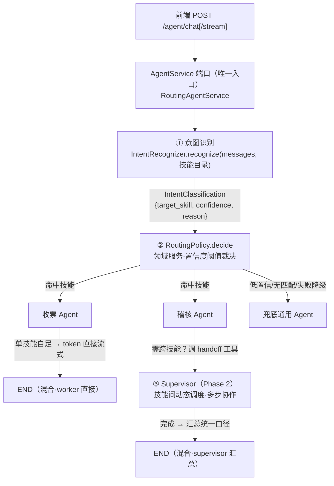
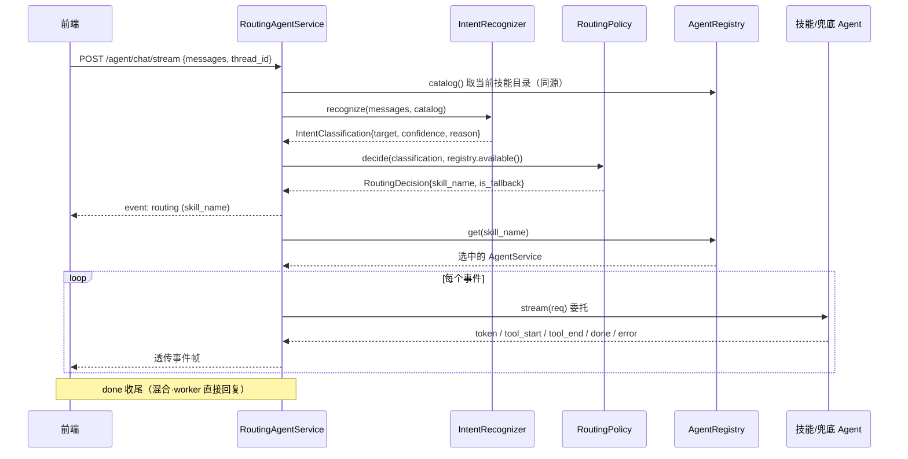

# Agent 动态路由与意图识别设计

| 项 | 内容 |
|---|---|
| 日期 | 2026-07-19 |
| 状态 | 已评审 · 待实现 |
| 范围 | 多技能 Agent 动态路由；核心为显式意图识别 + 路由裁决 + 分发 |
| 相关分支 | `feature/ddd-ai-finance` |
| 相关设计 | [Agent SSE 流式输出设计](2026-07-19-agent-sse-streaming-design.md) |

---

## 1. 背景与现状

项目已确立「单技能 Agent」模型：一个 `AgentEntity` 聚合根专精一个 `SkillConfig`，多技能靠多个 Agent 实例组合。配置（`AgentIdentity`、`SkillConfig` 列表、`LLMConfig`）来自 Nacos，支持热更新。对外出口是 `AgentService` 端口（`run` / `stream`），并已设计 SSE 流式链路。

**缺口**：当前 [`build_container`](../../../src/bootstrap/container.py) 只用 `DEFAULT_AGENT_PROMPT` 装配**单个** Agent，既没有把 Nacos 的技能列表真正建成「每技能一个 Agent」，也没有任何「根据用户意图选择 Agent」的机制。用户需要 **Agent 动态路由**：来一条消息，识别意图 → 选中最合适的技能 Agent → 分发处理。

盘点后，要补的是三块能力：

1. 把 N 个技能 Agent 真正构建出来并登记（注册表）。
2. 一个**显式的意图识别组件**（用户诉求的「意图识别 agent」）。
3. 一个路由分发器，复用现有 `AgentService` 出口，使 SSE/chat 端点零改动。

---

## 2. 目标与非目标

### 目标

- 新增**显式意图识别**组件：输入对话 + 技能目录，输出 `{目标技能, 置信度, 理由}` 结构化结果，可单测、可观测。
- 新增 `RoutingPolicy` **领域服务**：按置信度阈值裁决命中技能或兜底通用 Agent。
- 新增 `RoutingAgentService`：**实现现有 `AgentService` 端口**，编排「识别 → 裁决 → 分发」，使 interfaces/SSE 层零改动。
- 从 Nacos `SkillConfig` 列表**构建多技能 Agent 注册表**，并构建兜底通用 Agent。
- 流式协议追加 `routing` 事件，让前端可显示「已转接到某助手」。
- 任一识别环节失败**安全降级到兜底通用 Agent**。

### 非目标

- 不改造底层 `astream_events` 映射与 5 类基础事件（复用现状；仅追加 `routing`）。
- 不修正 `LangChainAgentService` 误置于 `interfaces/ai/` 的旧账（记为遗留项，见 §12）。
- 不引入 per-turn 之外的跨轮会话锁定——**每轮重新选入口**。
- Phase 1 不做跨技能多步协作（handoff supervisor 属 Phase 2，见 §11）。
- 分类器暂不做参数/槽位抽取（槽位归各技能 Agent 的 ReAct 循环）。

---

## 3. 关键设计决策

| 决策 | 选择 | 理由 | 被否方案 |
|---|---|---|---|
| 控制模型 | **Supervisor 常驻编排**（两段式） | 既要显式可控入口，又要深度多步协作能力 | 每轮独立分类器（无多步）；会话级锁定（跨技能切换需额外信号） |
| 实现方案 | **方案 C 两段式**：显式分类器入口 + handoff supervisor | 首轮显式可测 + 置信度兜底；深度协作时灵活 | A（无深度协作）；B（意图识别隐式、不可单测） |
| 意图识别形态 | **结构化输出的单次 LLM 调用**（非 ReAct agent） | 更快更省；输出契约稳定、可单测 | ReAct agent 分类（重、慢） |
| 识别与裁决分离 | **分类器只出「技能+置信度」，`RoutingPolicy` 独立裁决兜底** | 裁决纯逻辑、脱离 LLM 可单测；识别与策略解耦 | 分类器直接决定路由（策略与 LLM 耦合，难测） |
| 兜底策略 | **兜底通用 Agent 接住一切无法归类的请求** | 体验连贯；识别失败也能安全降级 | 反问澄清 / 直接拒答（体验割裂） |
| 回复声音 | **混合**：单技能 worker 直接回复；多技能由 supervisor 汇总 | 首字快、职责清晰，同时保多技能口径统一 | 全程 supervisor 汇总（首字慢、每次多一次 LLM） |
| 触发节奏 | **每轮重新选入口 + 轮内 supervisor 编排** | 便宜、每轮显式控制、天然处理话题切换 | 一次分类跨轮锁定（话题切换僵硬） |
| 对外出口 | **`RoutingAgentService` 实现现有 `AgentService` 端口** | interfaces/SSE/DI 零改动，路由复杂度内敛 | 新增专用路由端点（interfaces 层被迫感知路由） |
| 路由可见性 | **追加 `routing` 事件**（skill_name 上线，置信度/理由仅进日志） | 前端可显示「转接」徽标；线协议保持精简、向后兼容 | 复用 tool_start（语义混淆）；置信度全上线（冗余） |

---

## 4. 架构与两段式流程

对外仍只有一个 `AgentService` 入口，路由复杂度全部内敛于入口实现。



### 「意图识别 agent」落点

即第一段的 `IntentRecognizer`——结构化输出分类器，输入对话 + 技能目录（复用 Nacos `SkillConfig`），输出 `{目标技能, 置信度, 理由}`。它是一等、可单测、可观测的组件，可用更快更省的模型。

### 分期落地

| 阶段 | 交付 | 说明 |
|---|---|---|
| **Phase 1** | 第一段全链路 | 分类器 + `RoutingPolicy` + 技能 Agent 注册表 + 分发到单技能/兜底，复用 `AgentService` 端口与 SSE。**端到端跑通「动态路由 + 意图识别 agent」**。此期技能 Agent 不带 handoff 工具 → 必然自足 → 直接回复。 |
| **Phase 2** | 第二段 | 技能 Agent 加 handoff 工具 + supervisor 节点 + 汇总。触发跨技能协作时才走这段。细节见 §11，另起 spec。 |

分期让 worker「自足 vs 需协作」的边界很干净：Phase 1 的 worker 没有 handoff 工具，天然自足；Phase 2 才引入协作能力。

---

## 5. 分层组件设计（DDD 落点）

严格遵循 `interfaces → application → domain ← infrastructure`。**决策数据与策略进 domain，AI 能力做成端口 + 基础设施实现。**

### 5.1 领域层 `src/domain/`（零框架依赖）

| 组件 | 位置 | 类型 | 职责 |
|---|---|---|---|
| `IntentClassification` | `domain/value_objects/intent.py` | 值对象(frozen) | 分类结果 |
| `RoutingDecision` | `domain/value_objects/intent.py` | 值对象(frozen) | 裁决结果 |
| `RoutingPolicy` | `domain/services/routing_policy.py`（新目录） | 领域服务(无状态) | 置信度阈值裁决 |
| `RoutingConfig` | `domain/value_objects/routing_config.py` | 值对象(frozen) | 阈值/兜底技能名等策略参数 |
| `GENERAL_SKILL` | `domain/shared/general_skill.py` | `SkillConfig` 常量 | 兜底通用 Agent 的技能定义 |

```python
# domain/value_objects/intent.py
from pydantic import BaseModel, Field

class IntentClassification(BaseModel):
    target_skill: str | None = Field(default=None, description="最匹配技能名；None=识别不出/通用")
    confidence: float = Field(ge=0.0, le=1.0, description="置信度")
    reason: str = Field(default="", description="判断理由（可观测/日志）")
    model_config = {"frozen": True}

class RoutingDecision(BaseModel):
    skill_name: str = Field(description="最终路由到的技能名")
    is_fallback: bool = Field(default=False, description="是否走了兜底")
    model_config = {"frozen": True}
```

```python
# domain/services/routing_policy.py
class RoutingPolicy:
    """无状态领域服务：把「识别结果」裁决为「路由目标」。"""

    def __init__(self, config: RoutingConfig) -> None:
        self._config = config

    @property
    def fallback_name(self) -> str:
        return self._config.fallback_skill_name

    def decide(self, c: IntentClassification, available: set[str]) -> RoutingDecision:
        target = c.target_skill
        if target is None or target not in available or c.confidence < self._config.confidence_threshold:
            return RoutingDecision(skill_name=self._config.fallback_skill_name, is_fallback=True)
        return RoutingDecision(skill_name=target, is_fallback=False)
```

```python
# domain/value_objects/routing_config.py
class RoutingConfig(BaseModel):
    confidence_threshold: float = Field(default=0.6, ge=0.0, le=1.0)
    fallback_skill_name: str = Field(default="general")
    model_config = {"frozen": True}
```

`RoutingPolicy` 纯逻辑、脱离 LLM 可单测——这是把「识别」与「裁决」拆开的最大收益。

### 5.2 应用层 `src/application/`（无框架依赖）

| 组件 | 位置 | 类型 | 职责 |
|---|---|---|---|
| `IntentRecognizer` | `application/ports/intent_recognizer.py` | 端口(Protocol) | `recognize(messages, skills) → IntentClassification` |
| `AgentRegistry` | `application/services/agent_registry.py` | 组合持有者 | 每技能持有 `(SkillConfig, AgentService)` |
| `RoutingAgentService` | `application/services/routing_agent_service.py` | 实现 `AgentService` 端口 | 编排：识别 → 裁决 → 分发 |

```python
# application/ports/intent_recognizer.py
from typing import Protocol
from domain.value_objects.intent import IntentClassification
from domain.value_objects.skill_config import SkillConfig

class IntentRecognizer(Protocol):
    async def recognize(
        self, messages: list[dict[str, str]], skills: list[SkillConfig],
    ) -> IntentClassification: ...
```

```python
# application/services/agent_registry.py
class AgentRegistry:
    """skill_name → (SkillConfig, AgentService)，分类器目录与可路由集合同源。"""

    def __init__(self, entries: dict[str, tuple[SkillConfig, AgentService]], fallback: str) -> None:
        if fallback not in entries:                       # fail-fast：兜底必须存在
            raise ValueError(f"兜底技能 '{fallback}' 未注册，无法启动")
        self._entries = entries
        self._fallback = fallback

    def get(self, skill_name: str) -> AgentService:
        entry = self._entries.get(skill_name) or self._entries[self._fallback]
        return entry[1]

    def available(self) -> set[str]:
        return set(self._entries.keys())

    def catalog(self) -> list[SkillConfig]:
        return [cfg for cfg, _ in self._entries.values()]
```

```python
# application/services/routing_agent_service.py
class RoutingAgentService:                # 实现 AgentService 端口（run / stream）
    def __init__(self, recognizer, policy, registry) -> None: ...

    async def _route(self, req: AgentRequest) -> RoutingDecision:
        catalog = self._registry.catalog()
        try:
            cls = await self._recognizer.recognize(req.messages, catalog)
        except Exception as exc:                          # 识别失败 → 安全降级
            logger.warning("意图识别失败，降级兜底: %s", exc)
            return RoutingDecision(skill_name=self._policy.fallback_name, is_fallback=True)
        return self._policy.decide(cls, self._registry.available())

    async def run(self, req: AgentRequest) -> AgentResponse:
        dec = await self._route(req)
        resp = await self._registry.get(dec.skill_name).run(req)
        return resp.model_copy(update={"routed_skill": dec.skill_name})

    async def stream(self, req: AgentRequest) -> AsyncIterator[AgentStreamEvent]:
        dec = await self._route(req)
        yield AgentStreamEvent(event_type="routing", skill_name=dec.skill_name,
                               content=_routing_message(dec))
        async for ev in self._registry.get(dec.skill_name).stream(req):
            yield ev
```

因为它实现**现有** `AgentService` 端口，bootstrap 只需把 DI 单例从「单个 agent」换成 `RoutingAgentService`——SSE/chat 端点、interfaces 层一行都不用动。

### 5.3 基础设施层 `src/infrastructure/ai/`（LLM 实现）

| 组件 | 位置 | 职责 |
|---|---|---|
| `LlmIntentRecognizer` | `infrastructure/ai/llm_intent_recognizer.py` | 实现 `IntentRecognizer`：`llm.with_structured_output(IntentClassification)` 单次结构化调用；prompt 由 `SkillConfig.name+description` 拼技能目录 |
| `build_agent_registry(...)` | `infrastructure/ai/skill_agent_builder.py` | 遍历 `SkillConfig` 列表：每 skill → `AgentPromptConfig(identity, skill)` → `create_react_agent` → `LangChainAgentService`；再建 `GENERAL_SKILL` 兜底 Agent，装进 `AgentRegistry` |
| supervisor 图（Phase 2） | `infrastructure/ai/supervisor_graph.py` | 技能 Agent 加 handoff 工具 + supervisor 节点 + 汇总；§11 细化 |

```python
# infrastructure/ai/llm_intent_recognizer.py（结构示意）
class LlmIntentRecognizer:
    def __init__(self, llm) -> None:
        self._structured = llm.with_structured_output(IntentClassification)

    async def recognize(self, messages, skills) -> IntentClassification:
        catalog = "\n".join(f"- {s.name}: {s.description}" for s in skills)
        prompt = _build_classify_prompt(catalog, messages)      # 列目录 + 要求择一 + 允许 None
        return await self._structured.ainvoke(prompt)
```

> 分类器是**单次结构化调用**，不是 ReAct agent（不用 `create_agent`），更快更省。新 AI 代码统一放 `infrastructure/ai/`，不沿袭 `LangChainAgentService` 误置于 `interfaces/ai/` 的旧账。`IntentClassification` 是纯 Pydantic 值对象（无框架依赖），`with_structured_output` 在基础设施层读取其 schema，领域层保持洁净。

### 5.4 接口层 `src/interfaces/`

不变。SSE/chat 端点面向 `AgentService` 端口，路由细节对它透明。

---

## 6. 数据流



非流式 `run` 同理：识别 → 裁决 → `return await worker.run(req)`，并回填 `routed_skill`。

---

## 7. 流式协议扩展：新增 `routing` 事件

SSE 设计冻结了 5 类事件；此处**追加**一类（SSE 规范尚「待实现」，协同更新其 §5.2 / §5.3）。

| 变更 | 内容 |
|---|---|
| `AgentStreamEvent.event_type` | 新增 `"routing"` |
| `AgentStreamEvent` | 新增可选字段 `skill_name: str \| None = None`（仅 routing 事件有值） |
| `AgentResponse` | 新增可选 `routed_skill: str \| None = None`（非流式也能观测路由结果） |

```
event: routing
data: {"event_type":"routing","content":"识别意图：稽核","skill_name":"auditing","tool_name":null,"timestamp":"..."}
```

- **每轮开头必发一次** routing 事件，前端可显示「已转接到稽核助手」徽标。
- 兜底时 `skill_name="general"`、`content` 写明「未匹配专业技能，转通用助手」。
- **置信度与理由只进服务端日志**，不上线，保持线协议精简。
- 向后兼容：原 5 类事件不受影响，未识别 `routing` 的旧前端可忽略该帧。

---

## 8. 错误处理与降级

核心原则：**意图识别是「尽力增强」，任一环节失败都安全退回兜底通用 Agent，绝不让路由失败演变成整通对话失败。**

| 场景 | 处理 |
|---|---|
| 分类器 LLM 失败/超时 | 捕获 → 降级路由到 general + 告警日志 |
| 置信度低于阈值 | `RoutingPolicy` → 兜底 general |
| target 不在可路由集 / 目录为空 | `RoutingPolicy` → 兜底 general |
| **general Agent 缺失** | **启动时 fail-fast**：`AgentRegistry` 构造校验，无兜底直接启动失败 |
| 流式中 worker 抛错 | 复用现状：worker.stream 已 yield `error` 事件 |
| 空 `messages` | 由 schema / 应用层校验，建议 `422` |

---

## 9. 配置与生命周期

- **`RoutingConfig`**：MVP 用默认值（阈值 0.6、兜底 `general`）在 bootstrap 注入；后续可仿现有仓储从 Nacos `routing-config` 热加载。
- **分类器 LLM**：MVP 复用主 `LLMClientFactory`（DeepSeek）；日后可换更便宜的分类模型（独立配置）。
- **单例**：沿用 SSE 设计——`RoutingAgentService` 在 `lifespan` 预热为单例存 `app.state`，`get_agent_service` 直接取。
- **热更新**：`skill-configs` 变化时，`SkillConfigRepository.watch` 回调**原子重建** `AgentRegistry`（技能 Agent 集合 + 目录一起换，加锁替换 `RoutingAgentService` 内部引用）。分类器目录取自 `registry.catalog()`，与可路由集合同源，天然跟随。
  - MVP 可先只在启动装配一次；因目录与注册表同源，即使分类器「看得到」某技能而其 Agent 尚未建好也不会发生——不存在指向未构建 Agent 的路由。

---

## 10. 组件装配（bootstrap 改造）

```python
# container.py（示意）
registry = build_agent_registry(
    identity=identity_repo.get("agent-identity"),
    skills=skill_repo.get("skill-configs"),
    general_skill=GENERAL_SKILL,
    llm_factory=llm_factory,
)
recognizer = LlmIntentRecognizer(llm_factory.create_llm())
policy = RoutingPolicy(RoutingConfig())
container.agent_service = RoutingAgentService(recognizer, policy, registry)
```

`lifespan` 预热该单例；`dependencies.get_agent_service` 返回 `app.state.agent_service`。interfaces 层不变。

---

## 11. 测试策略

**单元**（零真实 LLM，在 `IntentRecognizer` 与 `AgentService` 两个端口缝注入 stub）：

- `RoutingPolicy.decide`：高置信命中 / 低置信兜底 / `None` 兜底 / target∉可路由集兜底——纯函数，无 mock。
- `IntentClassification` / `RoutingDecision`：字段校验（置信度边界 0..1）。
- `RoutingAgentService`（stub recognizer + stub workers）：路由到正确 worker；**先发 `routing` 事件再发 worker 事件**；recognizer 抛错 → 降级 general；`run` 回填 `routed_skill`。
- `LlmIntentRecognizer`：prompt 由技能目录拼出（含各 skill name/description）；结构化输出解析（mock LLM 返回 schema 实例）。
- `AgentRegistry`：get / available / catalog；缺失技能 → 兜底；**无兜底 → 构造抛错**。

**集成**（`httpx.ASGITransport` + stub，不打真实 LLM）：

- `POST /agent/chat/stream`：**首帧是 `event: routing`**，随后 worker 帧，`done` 收尾。
- 兜底路径：routing 事件 `skill_name=general`。
- 分类器故障：仍 `200`，降级 general 并正常流式。

**DDD 校验**：domain（`RoutingPolicy` / `IntentClassification` / `RoutingDecision`）无任何框架 import。

---

## 12. Phase 2 方向（handoff supervisor，另起 spec）

Phase 2 引入跨技能多步协作，届时单独出 spec 细化，方向如下：

- **技能 Agent 加 handoff 工具**：worker 的 ReAct 循环判断需要跨技能协助时，调用 handoff 工具 → LangGraph `Command(goto="supervisor")`。
- **supervisor 节点**：以 handoff 工具在技能 Agent 间动态调度；多步完成后**汇总统一口径**再回复（混合·supervisor 汇总）。
- **入口衔接**：第一段显式分类器仍负责选「入口 worker」；进入某技能后若触发 handoff 才进第二段。
- **图形态**：`entry → intent_classifier → route → {skill_i | general}`，各 skill 节点 `→(handoff? supervisor : END)`，`supervisor →(需 skill_j? skill_j : synthesize→END)`。
- 分类器/路由节点做成**薄适配器**，内部委托注入的 `IntentRecognizer` 端口 + `RoutingPolicy` 领域服务，保持决策大脑可单测。

---

## 13. 已知遗留 / 后续项

- **`LangChainAgentService` 分层位置**：现于 `interfaces/ai/`，按铁律应在 `infrastructure`。本次新代码不沿袭此误置，旧账另行修正。
- **SSE 规范同步**：本设计新增 `routing` 事件，需回填 [SSE 设计](2026-07-19-agent-sse-streaming-design.md) §5.2 / §5.3。
- **`RoutingConfig` 上 Nacos**：MVP 走默认值，后续接 `routing-config` 热加载。
- **分类器独立模型**：MVP 复用主 LLM，后续可配更便宜的分类专用模型。
- **技能 Agent 热重建**：MVP 可先启动装配一次，热更新原子重建为后续增强。
- **鉴权 / 限流 / 可观测**：路由决策的埋点与限流，未来补充。
